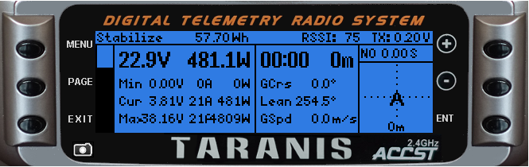
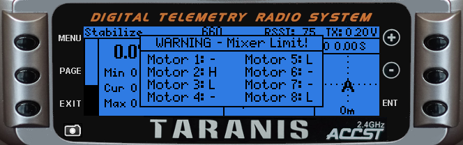

# ArduPilot_Taranis
ArduPilot Screens for FrSky Taranis

This project implements a few telemetry screens for the FrSky Taranis transmitter. To use them, ArduPilot should be confiugred to ouput telemetry data on one of its UART ports. This port has to be connected directly to the Smart Port of the FrSky receiver, using appropriate interface circuitry. iA MAVLink-Smart-Port converter is not required.

Here are some sample screenshots:

